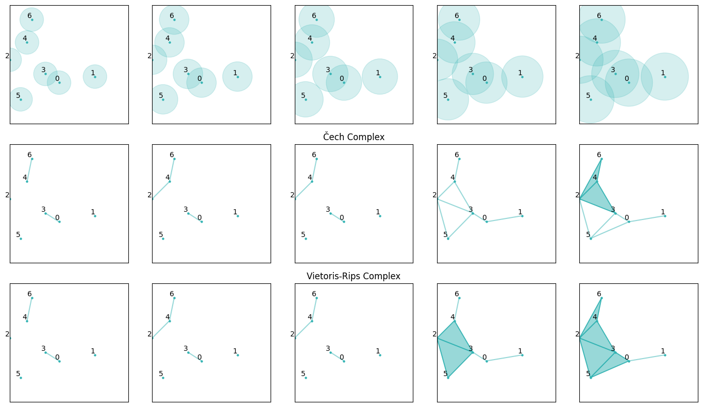

Notebook based on [Katherine Benjamin's lecture on TDA](https://www.youtube.com/watch?v=8qXOdF1_nm8). [[Personal notes]](https://github.com/HC-85/Obsidian-Vaults/blob/main/Science%20%26%20Math/Topological%20Data%20Analysis%20Tutorial.md)

Constructs a filtration of both Čech complexes and their Vietoris-Rips approximations from a set of two-dimensional points.

  

Persistence diagrams and persistence images are pending.
